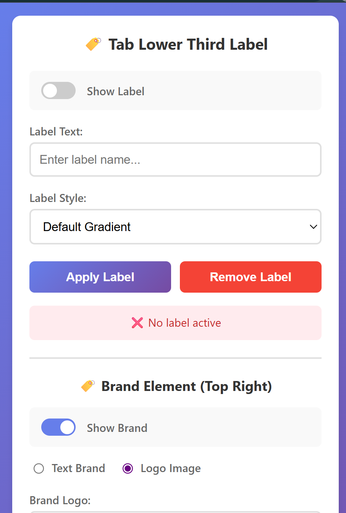

# Professional Lower Thirds & Brand Overlay

[](https://chrome.google.com/webstore)
[](#)
[](#license)

A powerful Chrome extension that adds professional lower third labels and brand overlays to any webpage. Perfect for content creators, streamers, and professionals who want to enhance their web content with custom branding and labels.



## ✨ Features

### 🏷️ Lower Third Labels
- **17+ Professional Themes** - Choose from news, corporate, gaming, neon, and more
- **Custom Text** - Add any text up to 50 characters
- **Smooth Animations** - Professional slide-in effects
- **Responsive Design** - Works on all screen sizes
- **Per-Tab Settings** - Different labels for each tab

### 🎯 Brand Overlay
- **Dual Positioning** - Top-right corner brand placement
- **Text or Logo** - Support for custom text or image files
- **File Upload** - PNG/JPG logo support with preview
- **13 Background Styles** - Gradients, solid colors, transparent options
- **Global or Per-Tab** - Apply to all tabs or specific pages
- **Professional Styling** - Adaptive width containers

### 🎨 Theme Styles
- **Default Gradient** - Purple/blue professional gradient
- **Classic Black** - Traditional news style
- **News Red** - Broadcast journalism look
- **Corporate Blue** - Business professional
- **Neon Green** - Modern tech/gaming style
- **Sports Orange** - Dynamic sports broadcast
- **Elegant Gold** - Sophisticated presentation
- **Gaming Purple** - Esports/gaming aesthetic
- **Minimal White** - Clean, modern design
- **Retro 80s** - Vintage pixel art style
- **Glassy Transparent** - Modern glass effect
- **Dark Mode** - Professional dark theme
- **Neon Pink** - Cyberpunk aesthetic
- **Fire Orange** - Animated glow effects
- **Ocean Blue** - Wave-like animations
- **Matrix Green** - Hacker/tech style
- **Sunset Orange** - Warm gradient theme

## 🚀 Installation

### From Chrome Web Store
1. Visit the [Chrome Web Store page](#)
2. Click "Add to Chrome"
3. Confirm installation
4. The extension icon will appear in your browser toolbar

### From Source
1. Clone this repository:
   ```bash
   git clone https://github.com/vinaysarupuru/professional-lower-thirds-extension.git
   ```
2. Open Chrome and go to `chrome://extensions/`
3. Enable "Developer mode" in the top right
4. Click "Load unpacked" and select the extension folder
5. The extension is now installed and ready to use

## 📖 Usage

### Quick Start
1. **Click the extension icon** in your browser toolbar
2. **Enter your label text** in the text field
3. **Choose a theme** from the dropdown menu
4. **Click "Apply Label"** to display it on the current webpage

### Adding Brand Overlay
1. **Scroll down** to the "Brand Element" section
2. **Toggle "Show Brand"** to enable branding
3. **Choose between text or logo**:
   - For text: Enter your brand name
   - For logo: Upload a PNG/JPG file
4. **Select background style** and scope (all tabs or current tab)
5. **Click "Apply Brand"** to display it

### Advanced Features
- **Per-Tab Labels**: Each tab can have its own unique label
- **Global Branding**: Set a brand that appears on all tabs
- **Mobile Responsive**: Automatically adjusts for different screen sizes
- **Persistent Settings**: Labels and brands persist across page refreshes

## 🛠️ Development

### Prerequisites
- Node.js (for development tools)
- Chrome browser
- Basic knowledge of JavaScript, HTML, CSS

### Project Structure
```
professional-lower-thirds-extension/
├── manifest.json          # Extension configuration
├── popup.html            # Extension popup interface
├── popup.js              # Popup functionality
├── content.js            # Content script for webpage injection
├── background.js         # Background service worker
├── styles.css            # All styling for overlays
├── test.html             # Testing page
├── assets/               # Images and icons
│   ├── icon16.png
│   ├── icon48.png
│   ├── icon128.png
│   └── preview.png
└── docs/                 # Documentation
    └── CHANGELOG.md
```

### Building
No build process required - this is a pure JavaScript extension.

### Testing
1. Load the extension in developer mode
2. Open `test.html` in your browser
3. Use the extension popup to test functionality
4. Check browser console for debug messages

## 🎯 Use Cases

### Content Creators
- **YouTube Videos**: Add professional labels to web content
- **Live Streaming**: Brand your stream with custom overlays
- **Tutorials**: Label different sections of your content

### Business Professionals
- **Presentations**: Add company branding to web demos
- **Client Meetings**: Professional overlay for screen sharing
- **Marketing**: Branded content for social media

### Educators
- **Online Classes**: Label different topics and sections
- **Course Creation**: Professional branding for educational content
- **Webinars**: Add presenter information and branding

## 🔧 Configuration

### Storage
The extension uses Chrome's local storage API to save:
- Lower third settings per tab
- Global brand settings
- User preferences and uploaded logos

### Permissions
Required permissions:
- `activeTab`: Access to current tab for content injection
- `storage`: Save user settings and preferences
- `tabs`: Manage tab-specific settings
- `scripting`: Inject content scripts when needed

## 🤝 Contributing

We welcome contributions! Here's how you can help:

1. **Fork the repository**
2. **Create a feature branch**: `git checkout -b feature/amazing-feature`
3. **Commit your changes**: `git commit -m 'Add amazing feature'`
4. **Push to the branch**: `git push origin feature/amazing-feature`
5. **Open a Pull Request**

### Contribution Guidelines
- Follow existing code style and conventions
- Test your changes thoroughly
- Update documentation as needed
- Add comments for complex functionality

## 📝 Changelog

### Version 1.0.0 (2024-09-24)
- ✨ Initial release
- 🏷️ 17 professional lower third themes
- 🎯 Separate brand overlay system
- 📁 File upload support for logos
- 📱 Mobile responsive design
- 🌐 Global and per-tab settings
- ⚡ Smooth animations and transitions

## 🐛 Known Issues

- Logo files are stored in browser storage (size limitations apply)
- Some websites with strict Content Security Policy may block overlays
- Brand overlay position may conflict with website's fixed elements

## 🔮 Roadmap

- [ ] More animation effects
- [ ] Custom positioning options
- [ ] Import/export settings
- [ ] Template presets
- [ ] Advanced typography controls
- [ ] Multi-language support

## 📄 License

This project is licensed under the MIT License - see the [LICENSE](LICENSE) file for details.

## 🙏 Acknowledgments

- Inspired by professional broadcast graphics
- Built with modern web technologies
- Thanks to the Chrome extension development community

## 📞 Support

- **Issues**: [GitHub Issues](https://github.com/vinaysarupuru/professional-lower-thirds-extension/issues)
- **Documentation**: [Wiki](https://github.com/vinaysarupuru/professional-lower-thirds-extension/wiki)
- **Email**: support@yourextension.com

---

**Made with ❤️ for content creators and professionals worldwide.**
